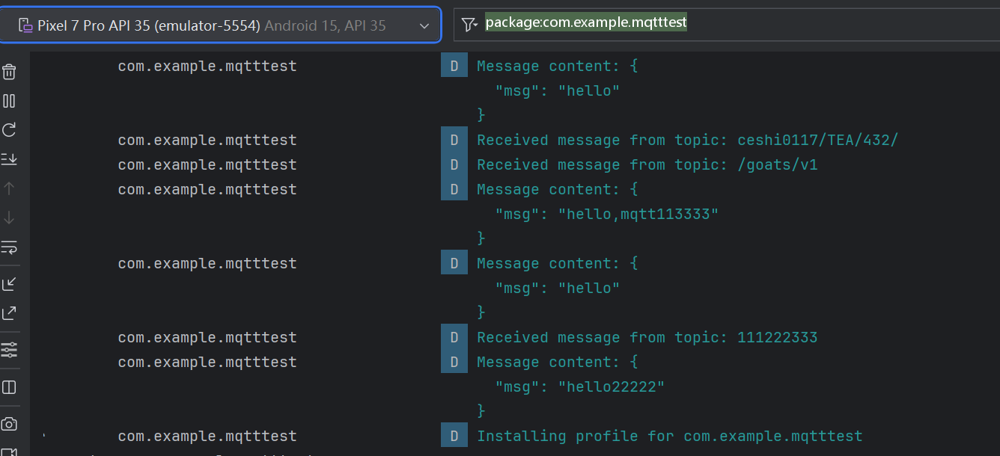
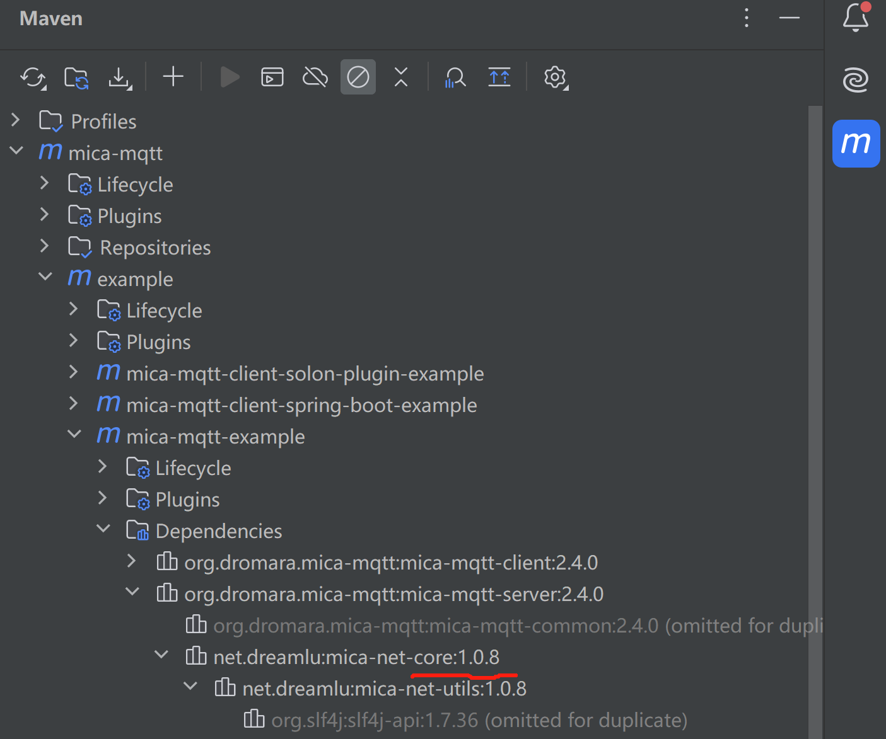

## 科普视频

- [mqtt科普、mqttx、mica-mqtt的使用**视频**](https://www.bilibili.com/video/BV1wv4y1F7Av/)

## 使用

#### 1. 添加依赖

```groovy
implementation 'org.dromara.mica-mqtt:mica-mqtt-server:$micaMqttVersion' // 使用 2.4.2 或以上版本
```

#### 2. 排除 INDEX.LIST 文件
```groovy
android {
    // ... 其他配置
    packagingOptions {
        // 排除 INDEX.LIST 文件
        exclude 'META-INF/INDEX.LIST'
    }
}
```

#### 3. 服务端使用
```java
// 注意：为了能接受更多链接（降低内存），请添加 jvm 参数 -Xss129k
MqttServer mqttServer = MqttServer.create()
    // 服务端 ip 默认为空，0.0.0.0，建议不要设置
    .ip("0.0.0.0")
    // 默认：1883
    .port(1883)
    // 默认为： 8092（mqtt 默认最大消息大小），为了降低内存可以减小小此参数，如果消息过大 t-io 会尝试解析多次（建议根据实际业务情况而定）
    .readBufferSize(512)
    // 最大包体长度，如果包体过大需要设置此参数，默认为： 8092
    .maxBytesInMessage(1024 * 100)
    // 自定义认证
    .authHandler((clientId, userName, password) -> true)
    // 消息监听
    .messageListener((context, clientId, message) -> {
        logger.info("clientId:{} message:{} payload:{}", clientId, message, new String(message.getPayload(), StandardCharsets.UTF_8));
    })
    // 心跳超时时间，默认：120s
    .heartbeatTimeout(120_1000L)
    // ssl 配置
    .useSsl("", "", "")
    // 开启代理协议，支持 nginx 开启 tcp proxy_protocol on; 时转发源 ip 信息。2.4.1 版本开始支持
    .proxyProtocolEnable()
    // 自定义客户端上下线监听
    .connectStatusListener(new IMqttConnectStatusListener() {
        @Override
        public void online(String clientId) {

        }

        @Override
        public void offline(String clientId) {

        }
    })
    // 自定义消息转发，可用 mq 广播实现集群化处理
    .messageDispatcher(new IMqttMessageDispatcher() {
        @Override
        public void config(MqttServer mqttServer) {

        }

        @Override
        public boolean send(Message message) {
            return false;
        }

        @Override
        public boolean send(String clientId, Message message) {
            return false;
        }
    })
    .debug() // 开启 debug 信息日志
    .start();

// 发送给某个客户端
mqttServer.publish("clientId","/test/123", "mica最牛皮".getBytes(StandardCharsets.UTF_8));

// 发送给所有在线监听这个 topic 的客户端
mqttServer.publishAll("/test/123", "mica最牛皮".getBytes(StandardCharsets.UTF_8));

// 停止服务
mqttServer.stop();
```



#### 3. http 和 websocket 依赖：

开启 http 或 websocket 需要添加 mica-net-http 依赖，如果不需要 http、websocket 把它们可以使用 `.httpEnable(false)` 和 `.websocketEnable(false)` 关掉就不需要该依赖了。

```groovy
implementation 'net.dreamlu:mica-net-http:$micaNetVersion'
```

如何确定 mica-net 的版本？可以打开 idea maven 依赖查看，当前依赖的 `mica-net-core` 版本，请确保跟 `mica-net-core` 使用一样的版本，避免版本兼容问题。



另外 http api 需要项目带有 jackson、fastjson、fastjson2、gson、hutool-json、snack3（mica-mqtt 2.3.4开始支持） 这些json工具其一。


